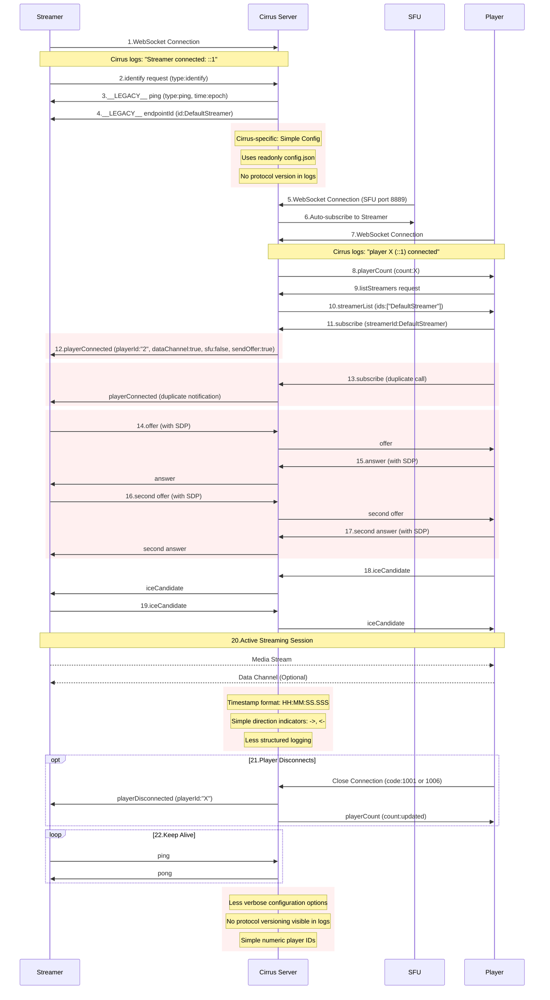

# Cirrus Flow

```mermaid
sequenceDiagram
    participant S as Streamer
    participant CS as Cirrus Server
    participant SFU as SFU
    participant P as Player

    %% Initial Connection Phase
    S->>CS: 1.WebSocket Connection
    note over CS,S: Cirrus logs: "Streamer connected: ::1"
    S->>CS: 2.identify request (type:identify)
    CS->>S: 3.__LEGACY__ ping (type:ping, time:epoch)
    CS->>S: 4.__LEGACY__ endpointId (id:DefaultStreamer)

    %% Configuration
    rect rgb(255, 240, 240)
        note over CS: Cirrus-specific: Simple Config
        note over CS: Uses readonly config.json
        note over CS: No protocol version in logs
    end

    %% SFU Connection (Optional)
    SFU->>CS: 5.WebSocket Connection (SFU port 8889)
    CS->>SFU: 6.Auto-subscribe to Streamer

    %% Player Connection & Stream Setup
    P->>CS: 7.WebSocket Connection
    note over CS,P: Cirrus logs: "player X (::1) connected"
    CS->>P: 8.playerCount (count:X)
    P->>CS: 9.listStreamers request
    CS->>P: 10.streamerList (ids:["DefaultStreamer"])
    P->>CS: 11.subscribe (streamerId:DefaultStreamer)
    
    %% Cirrus-specific connection message format
    rect rgb(255, 240, 240)
        CS->>S: 12.playerConnected (playerId:"2", dataChannel:true, sfu:false, sendOffer:true)
    end

    %% Multiple subscribe calls in Cirrus
    rect rgb(255, 240, 240)
        P->>CS: 13.subscribe (duplicate call)
        CS->>S: playerConnected (duplicate notification)
    end
    
    %% WebRTC Negotiation without scalability mode
    rect rgb(255, 240, 240)
        S->>CS: 14.offer (with SDP)
        CS->>P: offer
        P->>CS: 15.answer (with SDP)
        CS->>S: answer
        
        %% Multiple offer-answer exchanges
        S->>CS: 16.second offer (with SDP)
        CS->>P: second offer
        P->>CS: 17.second answer (with SDP)
        CS->>S: second answer
    end

    %% ICE Candidate Exchange
    P->>CS: 18.iceCandidate
    CS->>S: iceCandidate
    S->>CS: 19.iceCandidate
    CS->>P: iceCandidate

    %% Streaming & Data Channels
    Note over S,P: 20.Active Streaming Session
    S-->>P: Media Stream
    P-->>S: Data Channel (Optional)

    %% Cirrus-specific Logging
    rect rgb(255, 240, 240)
        note over CS: Timestamp format: HH:MM:SS.SSS
        note over CS: Simple direction indicators: ->, <-
        note over CS: Less structured logging
    end

    %% Disconnect Scenarios with specific format
    opt 21.Player Disconnects
        P->>CS: Close Connection (code:1001 or 1006)
        CS->>S: playerDisconnected (playerId:"X")
        CS->>P: playerCount (count:updated)
    end

    %% Health Checks
    loop 22.Keep Alive
        S->>CS: ping
        CS->>S: pong
    end

    %% Additional Cirrus-Specific Features
    rect rgb(255, 240, 240)
        note over CS: Less verbose configuration options
        note over CS: No protocol versioning visible in logs
        note over CS: Simple numeric player IDs
    end
```
