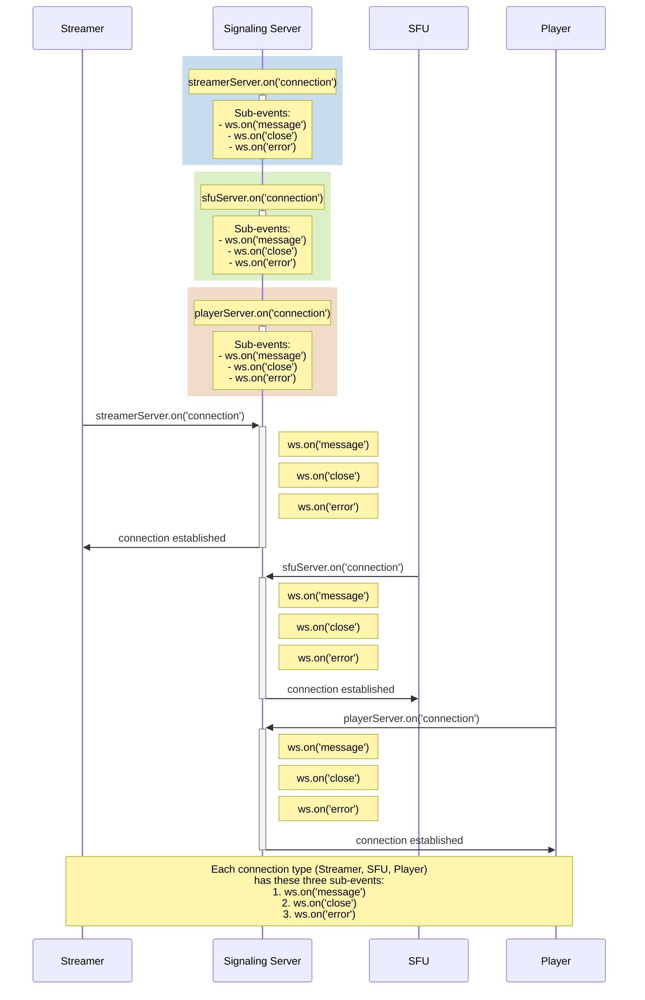
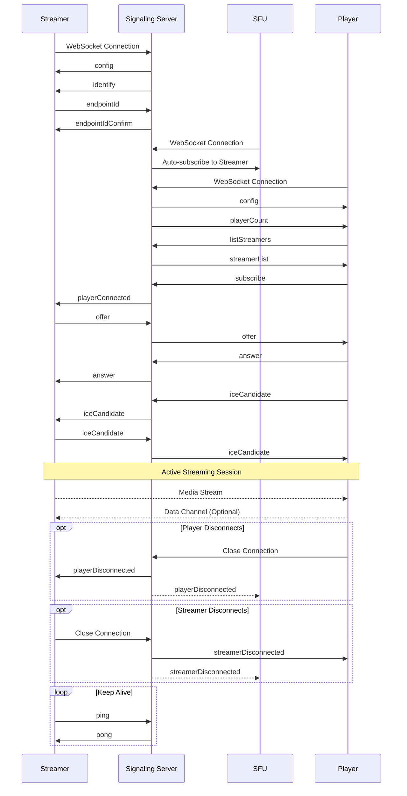

# pixel-streaming-flow
Establishing Connection

```mermaid

sequenceDiagram
    participant S as Streamer
    participant SS as Signaling Server
    participant SFU as SFU
    participant P as Player

    %% Main Server Events with Sub-events
    rect rgb(200, 220, 240)
        Note over SS: streamerServer.on('connection')
        activate SS
        Note over SS: Sub-events:<br/>- ws.on('message')<br/>- ws.on('close')<br/>- ws.on('error')
        deactivate SS
    end

    rect rgb(220, 240, 200)
        Note over SS: sfuServer.on('connection')
        activate SS
        Note over SS: Sub-events:<br/>- ws.on('message')<br/>- ws.on('close')<br/>- ws.on('error')
        deactivate SS
    end

    rect rgb(240, 220, 200)
        Note over SS: playerServer.on('connection')
        activate SS
        Note over SS: Sub-events:<br/>- ws.on('message')<br/>- ws.on('close')<br/>- ws.on('error')
        deactivate SS
    end

    %% Connection Flow
    S->>+SS: streamerServer.on('connection')
    Note right of SS: ws.on('message')
    Note right of SS: ws.on('close')
    Note right of SS: ws.on('error')
    SS->>-S: connection established

    SFU->>+SS: sfuServer.on('connection')
    Note right of SS: ws.on('message')
    Note right of SS: ws.on('close')
    Note right of SS: ws.on('error')
    SS->>-SFU: connection established

    P->>+SS: playerServer.on('connection')
    Note right of SS: ws.on('message')
    Note right of SS: ws.on('close')
    Note right of SS: ws.on('error')
    SS->>-P: connection established

    Note over S,P: Each connection type (Streamer, SFU, Player)<br/>has these three sub-events:<br/>1. ws.on('message')<br/>2. ws.on('close')<br/>3. ws.on('error')

```

Sending & Receieving Data

```mermaid
sequenceDiagram
    participant S as Streamer
    participant SS as Signaling Server
    participant SFU as SFU
    participant P as Player

    %% Initial Connection Phase
    S->>SS: WebSocket Connection
    SS->>S: config
    SS->>S: identify
    S->>SS: endpointId
    SS->>S: endpointIdConfirm

    %% SFU Connection (Optional)
    SFU->>SS: WebSocket Connection
    SS->>SFU: Auto-subscribe to Streamer

    %% Player Connection & Stream Setup
    P->>SS: WebSocket Connection
    SS->>P: config
    SS->>P: playerCount
    P->>SS: listStreamers
    SS->>P: streamerList
    P->>SS: subscribe
    SS->>S: playerConnected

    %% WebRTC Negotiation
    S->>SS: offer
    SS->>P: offer
    P->>SS: answer
    SS->>S: answer
    
    %% ICE Candidate Exchange
    P->>SS: iceCandidate
    SS->>S: iceCandidate
    S->>SS: iceCandidate
    SS->>P: iceCandidate

    %% Streaming & Data Channels
    Note over S,P: Active Streaming Session
    S-->>P: Media Stream
    P-->>S: Data Channel (Optional)

    %% Disconnect Scenarios
    opt Player Disconnects
        P->>SS: Close Connection
        SS->>S: playerDisconnected
        SS-->>SFU: playerDisconnected
    end

    opt Streamer Disconnects
        S->>SS: Close Connection
        SS->>P: streamerDisconnected
        SS-->>SFU: streamerDisconnected
    end

    %% Health Checks
    loop Keep Alive
        S->>SS: ping
        SS->>S: pong
    end
```
