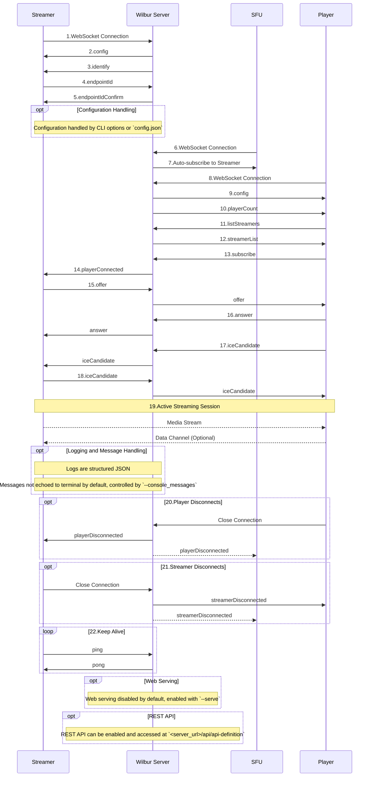

```mermaid
sequenceDiagram
    participant S as Streamer
    participant WS as Wilbur Server
    participant SFU as SFU
    participant P as Player

    %% Initial Connection Phase
    S->>WS: 1.WebSocket Connection
    WS->>S: 2.config
    WS->>S: 3.identify
    S->>WS: 4.endpointId
    WS->>S: 5.endpointIdConfirm

    %% New Wilbur-Specific Configuration Handling
    opt Configuration Handling
        note over S,WS: Configuration handled by CLI options or `config.json`
    end

    %% SFU Connection (Optional)
    SFU->>WS: 6.WebSocket Connection
    WS->>SFU: 7.Auto-subscribe to Streamer

    %% Player Connection & Stream Setup
    P->>WS: 8.WebSocket Connection
    WS->>P: 9.config
    WS->>P: 10.playerCount
    P->>WS: 11.listStreamers
    WS->>P: 12.streamerList
    P->>WS: 13.subscribe
    WS->>S: 14.playerConnected

    %% WebRTC Negotiation
    S->>WS: 15.offer
    WS->>P: offer
    P->>WS: 16.answer
    WS->>S: answer
    
    %% ICE Candidate Exchange
    P->>WS: 17.iceCandidate
    WS->>S: iceCandidate
    S->>WS: 18.iceCandidate
    WS->>P: iceCandidate

    %% Streaming & Data Channels
    Note over S,P: 19.Active Streaming Session
    S-->>P: Media Stream
    P-->>S: Data Channel (Optional)

    %% New Wilbur-Specific Logging and Message Handling
    opt Logging and Message Handling
        note over S,WS: Logs are structured JSON
        note over S,WS: Messages not echoed to terminal by default, controlled by `--console_messages`
    end

    %% Disconnect Scenarios
    opt 20.Player Disconnects
        P->>WS: Close Connection
        WS->>S: playerDisconnected
        WS-->>SFU: playerDisconnected
    end

    opt 21.Streamer Disconnects
        S->>WS: Close Connection
        WS->>P: streamerDisconnected
        WS-->>SFU: streamerDisconnected
    end

    %% Health Checks
    loop 22.Keep Alive
        S->>WS: ping
        WS->>S: pong
    end

    %% Additional Wilbur-Specific Steps
    opt Web Serving
        note over WS: Web serving disabled by default, enabled with `--serve`
    end

    opt REST API
        note over WS: REST API can be enabled and accessed at `<server_url>/api/api-definition`
    end

```
