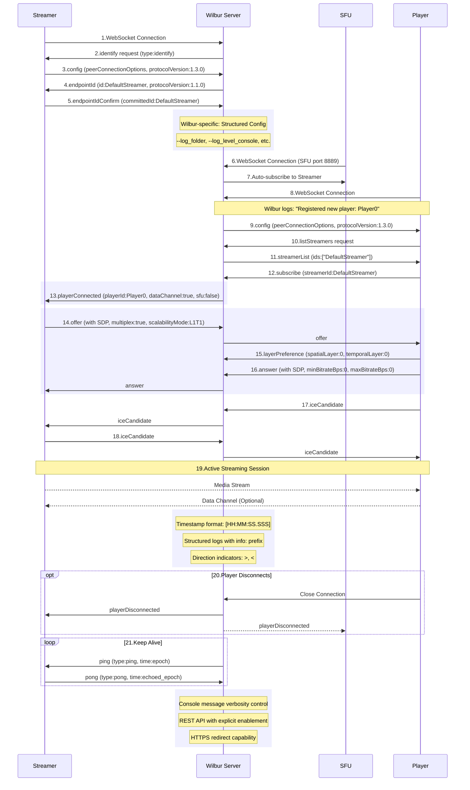

### Event Flow for Wilbur Server

```mermaid
sequenceDiagram
    participant S as Streamer
    participant WS as Wilbur Server
    participant SFU as SFU
    participant P as Player

    %% Initial Connection Phase
    S->>WS: 1.WebSocket Connection
    WS->>S: 2.identify request (type:identify)
    S->>WS: 3.config (peerConnectionOptions, protocolVersion:1.3.0)
    WS->>S: 4.endpointId (id:DefaultStreamer, protocolVersion:1.1.0)
    S->>WS: 5.endpointIdConfirm (committedId:DefaultStreamer)

    %% Configuration and Health Check
    rect rgb(240, 240, 255)
        note over WS: Wilbur-specific: Structured Config
        note over WS: --log_folder, --log_level_console, etc.
    end

    %% SFU Connection (Optional)
    SFU->>WS: 6.WebSocket Connection (SFU port 8889)
    WS->>SFU: 7.Auto-subscribe to Streamer

    %% Player Connection & Stream Setup
    P->>WS: 8.WebSocket Connection
    note over WS,P: Wilbur logs: "Registered new player: Player0"
    WS->>P: 9.config (peerConnectionOptions, protocolVersion:1.3.0)
    P->>WS: 10.listStreamers request
    WS->>P: 11.streamerList (ids:["DefaultStreamer"])
    P->>WS: 12.subscribe (streamerId:DefaultStreamer)
    
    %% Wilbur-specific connection message format
    rect rgb(240, 240, 255)
        WS->>S: 13.playerConnected (playerId:Player0, dataChannel:true, sfu:false)
    end

    %% WebRTC Negotiation with Wilbur-specific fields
    rect rgb(240, 240, 255)
        S->>WS: 14.offer (with SDP, multiplex:true, scalabilityMode:L1T1)
        WS->>P: offer
        P->>WS: 15.layerPreference (spatialLayer:0, temporalLayer:0)
        P->>WS: 16.answer (with SDP, minBitrateBps:0, maxBitrateBps:0) 
        WS->>S: answer
    end
    
    %% ICE Candidate Exchange
    P->>WS: 17.iceCandidate
    WS->>S: iceCandidate
    S->>WS: 18.iceCandidate
    WS->>P: iceCandidate

    %% Streaming & Data Channels
    Note over S,P: 19.Active Streaming Session
    S-->>P: Media Stream
    P-->>S: Data Channel (Optional)

    %% Wilbur-specific Logging and Message Handling
    rect rgb(240, 240, 255)
        note over WS: Timestamp format: [HH:MM:SS.SSS]
        note over WS: Structured logs with info: prefix
        note over WS: Direction indicators: >, <
    end

    %% Disconnect Scenarios
    opt 20.Player Disconnects
        P->>WS: Close Connection
        WS->>S: playerDisconnected
        WS-->>SFU: playerDisconnected
    end

    %% Health Checks with specific format
    loop 21.Keep Alive
        WS->>S: ping (type:ping, time:epoch)
        S->>WS: pong (type:pong, time:echoed_epoch)
    end

    %% Additional Wilbur-Specific Features
    rect rgb(240, 240, 255)
        note over WS: Console message verbosity control
        note over WS: REST API with explicit enablement
        note over WS: HTTPS redirect capability
    end
```
